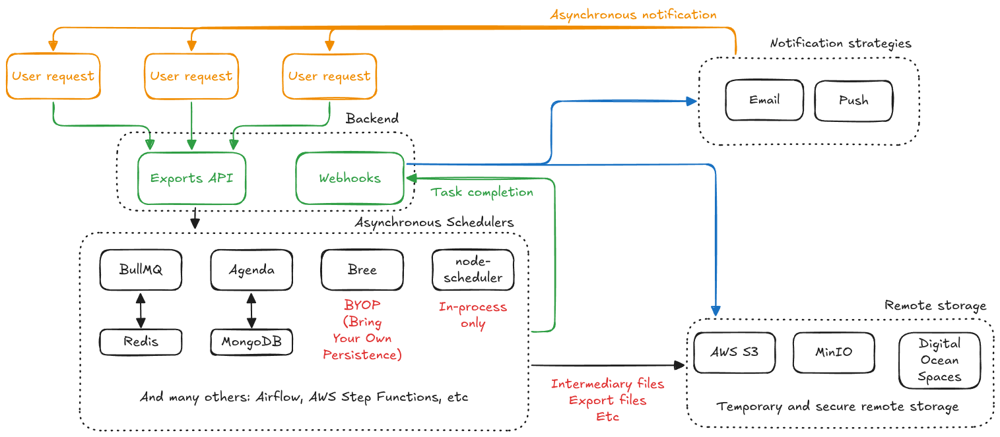

[][CI]

# Fullstack Interview Challenge

I've moved the existing README into INSTRUCTIONS.md and I'll use this document
to provide a quick usage refresher, as well as document my implementation
choices in the Task 1 and Task 2 problems.

# Task 1

## Usage

Usage remains exactly as before as I've went with the existing dependencies,
only adding new functionality and commands, not removing. Nevertheless, here
is a quick overview:

```sh
# Installation
npm install

# Serving the backend
npm run start

# Build
npm run build

# Format
npm run format

# Lint
npm run lint

# Test
npm run test
```

## Architecture

I decided to go with a MVC (Model-View-Controller) architecture, and mostly
stuck to the existing dependencies.

Broadly, these are the components I settled on:
* `models`: Database (or in this case JSON) schemas
* `views`: Presentation layer. Only JSON is currently implemented but 
  extensible to other formats
* `controllers`: Handling of incoming requests
* `dtos`: Data transfer objects (models) used in different HTTP requests
* `routes`: Thin layer registering the routes and calling appropriate
  controllers
* `repositories`: Encapsulates access to the different storages, in this case
  just our JSON files, but extensible enough to support actual DB access
* `services`: Some business logic that doesn't belong in controllers, like
  merging/fetching memberships along their membership periods together.
* `transformers`: Different parsers and validators for converting between
  different models, such as models from the `models` layer into `views` layer
  models, or `models` -> `dtos`, etc

Here is a high-level diagram overview of the code flow when a request comes
in:


### Testing/linting/formatting

Since I'm new to Typescript, I decided to go with the existing testing
framework (`jest`). I've implemented unit tests for the `transformers` and
`repositories` layer, and the rest of the layers are tested indirectly through
a whole flow (from the route through `supertest`) integration test. I could
have also written unit tests for the `services` layer, but in this case I saw
little value over just testing it through the route integration tests.

For formatting I set up `prettier`, and for linting `eslint`. These are now
set up as commands in the `package.json`.

### CI

CI has been set up with Github Actions. Right now this CI will just
automatically check linting/formatting/testing/building. In a proper project,
this would be expanded to apply to Pull Requests instead, and then the `main`
branch pushes would do something useful with the build result, like pushing it
to our server running the backend.

### Concerns

There are a few possible issues I found while trying to migrate this codebase,
mostly relating to the JSON schemas, as well as the `POST /memberships` code.
I've marked these with `NOTE` comments throughout the code, but I'll also
write them down here to provide a bit more context.

#### Membership entity: user

The README mentions this `user` field, but the JSON files use `userId`
instead, while the legacy `POST` code sets it to `user`. For my
implementation, it internally uses `userId`, but in the API response will
expose only `user` as expected to maintain backwards compatibility.

#### Membership entity: assignedBy

The README doesn't mention this `assignedBy` field, but the JSON files contain
it, and the legacy `GET` does return it in the API response. For my
implementation, I've valued backwards compatibility over everything and
decided to include it.

#### MembershipPeriod entity: membership/membershipId

The README only mentions a `membership` field. Likewise, the JSON file only
contains the `membership` field. However, the legacy `POST` code sets
`membershipId`, and that's what it will return in the API response. For my
implementation, I've valued backwards compatibility over everything and
decided to include it.

#### POST /memberships: billingPeriodsLessThan3Years error

The legacy `POST` code will trigger this error when the billing interval is
set to yearly, and the period is set to bigger than 3, but smaller than 10.
This doesn't match the error message, but for my implementation I've decided
to replicate it to maintain backwards compatibility.

#### POST /memberships: cashPriceBelow100 error

The legacy `POST` code will trigger this error when the `paymentMethod` is set
to `cash` **and** the `recurringPrice` is over `100`, which seems to
contradict the error message. For my implementation I've decided to replicate
it to maintain backwards compatibility.

#### POST /memberships: unreachable weekly intervals

The legacy `POST` code has a validation check for `monthly` and `yearly`
intervals, and an else for any other value that will raise
`invalidBillingPeriods`. That means that the `weekly` interval will always be
invalid. I've decided to replicate this behaviour regardless to maintain
backwards compatibility.


# Task 2

This part of the document will also be stored as a PDF alongside other
documentation in the [docs/ subdirectory][task2.pdf] as requested in the
instructions.

## Architecture

Here you can see a high-level overview of the whole architecture:



### Exports API (backend)

This might be a monolith or microservices. Either implementation works so the
choice is left to requirements and constraints. When the user requests an
export, it'll go to the **Exports API** (which might just be a separate route
in our existing monolith backend).

The **Exports API** will take in that request, run whatever validations
necessary, and then send it over to the **Asynchronous Scheduler**.

### Asynchronous Schedulers

Here I've decided to show multiple different options, since they all can
achieve the same thing. Here we'd research the different options and based on
our current and future requirements, settle on one option. Ideally whichever
tool is picked allows for monitoring as well as retries out of the box.

This layer will take care of actually running the long-lived job. Likewise,
this layer can also be used to set up periodic long-running tasks that might
not be directly triggered by the users.

Scaling of this layer highly depends on the specific tool and storage chosen,
but in most tools, it involves a combination of increasing the worker pool to
run more concurrent jobs, as well as scaling the storage layer to support more
concurrent accesses.

### Remote storage

Likewise, here I've decided to show multiple options, but you'd also settle on
one solution.

The reason why you need a remote storage layer is that it's often very
difficult (or even impossible) to serve large/asynchronously-created files
directly from the backend server. Even if those servers/containers had
infinite, non-volatile storage, that might leave you open to different kind of
attacks.

For this reason, it's often a good idea to use a separate and non-volatile
storage layer where you can control both the longevity of the files, as well
as access to those files. AWS S3 offers this with presigned URLs, that allow
temporary access to download/upload files to a given S3 bucket, without
exposing any other files in that bucket, and also auditing all accesses to
that bucket/file.

This layer can also be used for temporary intermediary files that the
**Asynchronous Schedulers** layer might need to complete a job.

### Webhooks (backend)

Another part of the backend, might just be a different route in our backend
monolith, or a whole new microservice. The **Webhooks** would get notified by
our **Asynchronous Scheduler** job that a given job is finished, along with
any necessary metadata. This API could also be used to report job failures.

Once a job has been completed (success or failure), this part would also be in
charge of deciding the notification strategy, and then sending it out to the
user. The notification strategies might just be set through the program
configuration, or might be set by the user picking whether they want email,
app notifications, in web notifications, etc.

For this, you'd likely want to have different notification templates, email,
push, etc, then pick the notification service (if any and necessary), create a
temporary and secure access to the given export file in the **Remote
storage**, then notify the user.

### Notification strategies

Here I've decided to model it as a separate part, as many notification
strategies, like emails or mobile push notifications, will often require
cumbersome third-party services. For something like email, services like AWS
SES, Mailgun, Sendgrid and others come to mind (setting up your own email
server is also possible, but quite an undertaking due to reputation checks).

For mobile push notifications, services like AWS SNS also offer integrations.


[CI]: https://github.com/Sighery/eversports-challenge/actions
[task2.pdf]: docs/task2.pdf
